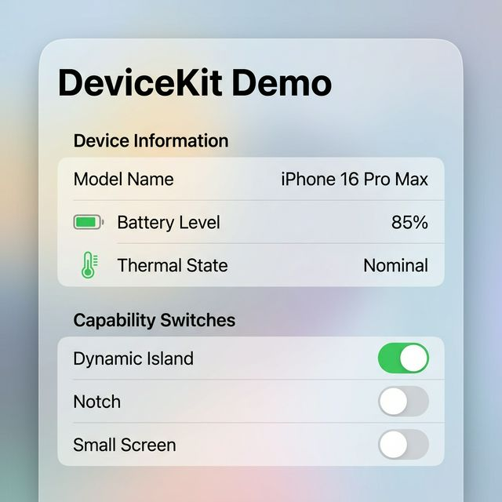

[](https://swiftpackageindex.com/ErsanQ/DeviceKit)
[](https://swiftpackageindex.com/ErsanQ/DeviceKit)
# DeviceKit

A lightweight, SwiftUI-friendly device identification and status package for iOS and macOS.



## Features
- **Zero Boilerplate**: Access device info via `Device.current`.
- **Async/Await**: Battery and Thermal status with modern concurrency.
- **Dynamic Identification**: Full support for iPhones/iPads up to 2026.
- **Smart Queries**: `hasDynamicIsland`, `hasNotch`, `isSmallScreen`, etc.
- **Safe Area Insets**: Get windows insets without needing a `GeometryReader`.

## Supported Platforms
- iOS 14.0+
- macOS 11.0+

## Installation

```swift
.package(url: "https://github.com/ErsanQ/DeviceKit", from: "1.0.0")
```

## Usage

### Device Details
```swift
let device = Device.current
print(device.modelName) // "iPhone 16 Pro Max"

if device.hasDynamicIsland {
    // Show Dynamic Island UI
}
```

### Battery & Thermal (Async)
```swift
Task {
    let level = await Device.current.batteryLevel()
    let status = await Device.current.thermalStatusDescription()
    print("Battery: \(level), Thermal: \(status)")
}
```

### Safe Area Insets (SwiftUI)
```swift
struct MyView: View {
    var body: some View {
        VStack {
            Text("Top Inset: \(Device.current.safeAreaInsets.top)")
        }
    }
}
```

## Author
ErsanQ (Swift Package Index Community)
